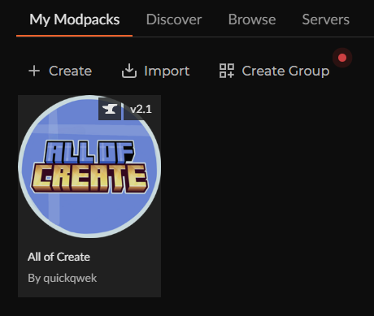

# Minecraft Create Setup

- Download CurseForge app: https://www.curseforge.com/download/app
- Home > Minecraft
- Go to My Modpacks and search "All of Create"
- Open All of Create and go to the `Versions` tab
- Install `All of Create 1.20.1 - 6.0 v2.1` - note the `v2.1`
- Run it

That's the lot