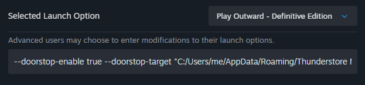

# Outward Mod Setup

This is mainly for the Steam version but it's probably applicable to others

## Switch to `default-mono` branch
1. Right click Outward in Steam > Properties > Betas
2. Change dropdown to the one that starts `default-mono`
  
Steam will download a bunch of stuff, may take a while

## Set up Thunderstone (mod manager)
1. Download Thunderstone from [here](https://www.overwolf.com/app/thunderstore-thunderstore_mod_manager) (it says Download on Overwolf but it doesn't actually, it just downloads Thunderstone)
2. When that's installed, open it
3. Select `Outward Definitive` as the game, make sure it's `Definitive`
4. Select `Steam` as platform
5. On the profile screen just click `Select profile`
6. You should now see the installed/available mods

### **IMPORTANT**
For some reason Thunderstone can't figure out where the Definitive version install is, need to set it manually:
1. Go to `Settings` on the left
2. Find or search for `Change Outward Definitive Folder`
3. In the file browser (which might be in the background), navigate to your Outward *Definitive* install (`SteamLocation/steamapps/common/Outward/Outward_Defed`) and select the `Outward Definitive Edition.exe`
4. Hit open and it should be set properly

## Get the mods
For all of these just choose latest version and install with dependencies if asked
- Raid_Mode by SpicerXD (enables more than 2 player coop)
- Sinais_Utility_Pack by sinai-dev (primarily gets rid of horrible smooth camera)

## Launch the game
You can launch the game with mods by clicking `Modded` at the top with the play button, alternatively you can make Steam launch it modded by doing the following:
1. Go to `Settings` on the left
2. Find or search for `Set launch parameters`
3. Copy the text under `Modded:` (`--doorstop-enable true ...`)
4. Go to Steam and right click Outward > Properties > General
5. Paste the text into the textbox at the bottom (under `Advanced users may choose...`)

Now when you launch from Steam it will launch modded

## That's the lot
It is done